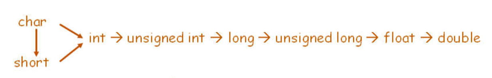
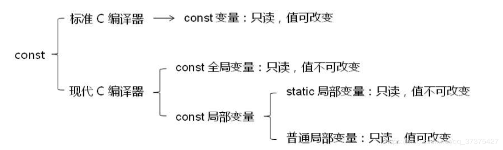
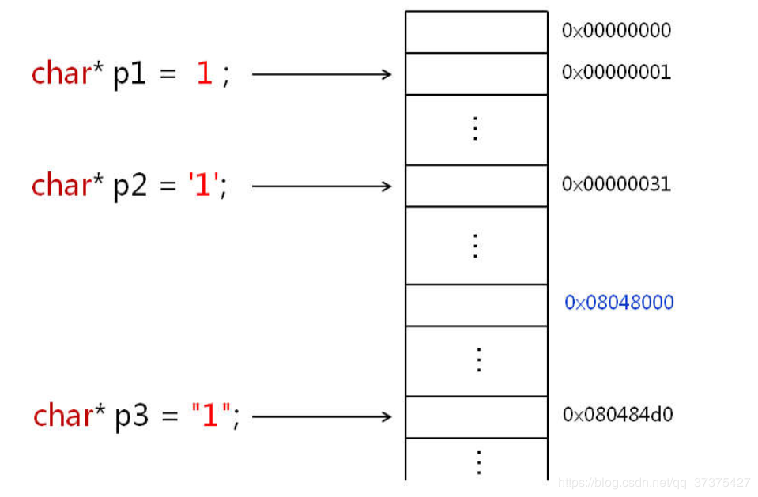

### 数据类型与变量

​	在C中，数据类型是变量的模子，可以把它理解成**固定大小的内存的别名**，当你用一个数据类型声明一个变量的时候，这个变量是**(依类型指定的大小的)具体的一段内存的名字**。当你使用*sizeof*的时候，如果传入的是变量类型，返回的是变量类型这个模子的大小，当传入变量名的时候，返回的是对应命名内存的大小，所以对于一个类型及其变量，*sizeof*返回值相同

```C
char a = 'a';
int b = 2;
char test_str[20] = "ss";
typedef char test_tp[20];
printf("char:\t%lu, %lu\n", sizeof(a), sizeof(char));
printf("int:\t%lu, %lu\n", sizeof(b), sizeof(int));
printf("char [20]:\t%lu, %lu\n", sizeof(test_str), sizeof(test_tp));
/* outputs:
char:   1, 1
int:    4, 4
char [20]:      20, 20
*/
```

#### 变量属性

```C
// 局部变量默认属性，存储与栈上
auto char i;
// 申请存储于寄存器中，不能用&获取地址
register int j;
// 静态
static long k;
// 外部导入 -or- 在C++中需要以C方式编译代码
extern double m;
```


### 无符号数和有符号数

​	通常使用的数据都是有符号数，但是像是*size_type*这种类型可能会比较经常参与到循环(**遍历列表**)或者普通的加减。对C语言来说，它无所谓unsigned还是signed，当你用有符号数和无符号数相加的时候其运算是按补码加法进行的，计算结果会被当成unsigned

```C
unsigned int a = 5;
int b = -10; // 当你使用-5 - 0之间的数，会产生溢出
int c = a + b;
printf("a: s = %d, us = %u\n", a, a);
printf("b: s = %d, us = %u\n", b, b);

printf("a + b: s = %d, us = %u\n", a + b, a + b);
printf("b + a: s = %d, us = %u\n", b + a, b + a);

if (b + a < 0)
    printf("a + b < 0\n");
else
    printf("a + b > 0\n");
/* outputs:
a: s = 5, us = 5
b: s = -10, us = 4294967286
a + b: s = -5, us = 4294967291
b + a: s = -5, us = 4294967291
a + b > 0
*/
```

### 浮点数

```C
float f = 3.1415f;
float fl = 123456789;

printf("%0.10f\n", f);
printf("%0.10f\n", fl);
/* outputs:
3.1414999962
123456792.0000000000
*/
```

**TODO: 计组**

### 类型转化

​	说再多都会犯错的地方



在这里，从定点数到浮点数的转化依旧要注意浮点数本身不精确的问题。

​	编译器会帮你做的隐式转化不会产生截断，但是当你需要进行强制转化的时候要小心截断的问题

```C
short s = 32767;
printf("sizeof(s) = %lu, sizeof(2*s) = %lu\n", 
       sizeof(s), sizeof(2 * s));
// sizeof(s) = 2, sizeof(2*s) = 4
```

### struct

​	GNU中，空的struct大小为0，在VS中则不允许这种用法

#### 柔性数组

​	在struct中使用一个不完善的数据类型，它不能使用sizeof。使用：

```C
struct test_9_stru {
  int len;
  int arr[];
};
// in function: 
struct test_9_stru softArr, *softArrPtr;
softArrPtr = (struct test_9_stru *)
    malloc(sizeof(struct test_9_stru) +sizeof(int) * 5);
softArrPtr->len = 5;


printf("sizeof(struct test_9_stru) = %lu\n", 
       sizeof(struct test_9_stru));
printf("sizeof(softArr) = %lu\n", sizeof(softArr));
printf("sizeof(*softArrPtr) = %lu\n",
       sizeof(*softArrPtr));
/*
sizeof(struct test_9_stru) = 4
sizeof(softArr) = 4
sizeof(*softArrPtr) = 4
*/
```

### C中的const

​	C的const定义的不是真正意义上的常量， 它只是告诉编译器它修饰的变量不能出现在赋值符号的左边 

- const修饰的变量是只读的，本质上还是变量
- const修饰的变量如果是局部非静态变量，则该变量存储在栈上
- const修饰的变量如果是全局变量，则该变量一定是存储在全局的数据区（.data）
- const修饰的变量，在程序编译期就得出了相应的属性，在运行期间该const关键字没有作用

> 在现代C语言编译器中，修改const修饰的变量会导致程序段错误。程序崩溃。因为现代C语言编译器会将const修饰的变量储存在只读存储区（.rodata）。
>
> 但是在标准C语言编译器中，不会将const修饰的变量储存在只读存储区。而是储存在可修改的全局数据区（.data），所以它的值依然可以改变。只要通过指针找到它的地址，就可以改变它的值。
>
> 

```C
const int i = 0;
const static int j = 0;

test_7_modi((int *)&i, 1);
// Segmentation fault
//   test_7_modi((int *)&j, 1);

printf("i = %d\n", i);
// i = 1
```

### enum

​	 enum定义的值是C语言中真正意义上的常量，如果想通过它定义常量，通常会只用无名枚举，如果有常量数值相同得定义多个enum

```C
enum {
    BUFFERSIZE = 20
}
// 直接使用BUFFERSIZE就可以了
```

### sizeof

​	sizeof是在编译器“计算的”，所以像是 *sizeof(var++)*， 压根不会执行++

### 字符与字符串

​	单引号表示的是**字符字面量**，双引号表示的是字符串字面量。字符和字符串真的就是看着像，实际在C语言中(变量存储)是天差地别的。

```
char *p1 = 1;
char *p2 = '1';
cahr *p3 = "1";
```

​	字符字面量会被编译成对应的ASCII码的数值，上面第一条语句一看就知道错，但是第二条语句和第一条是一样的，将'1'对应的ASCII码数值赋给了一个指针。字符串字面量会被编译成对应内存的地址。



### void

​	 **如果没有参数，并且不声明为void，则函数参数默认是任意的**。**如果函数没有返回值，但是不声明为void，则函数默认返回值是int**

### 数组

​	首先得注意的是关于数组名(变量)及其地址，如果会搞混都来自于一个问题：**数组名表示数组首元素的地址**，相较于普通的变量，这的确是不太一样。但是除了这个外，其他地方数组和普通变量是一样的，当使用*&a*(a为数组名)的时候得到的是“数组的地址”，它在字面值上和*a*是相等的，但是要注意它表示的意义不一样，*&a*既然表示数组地址那对其+1，则会指向数组最后一个元素的地址的下一个地址，而对*a*+1，只是指向第二个元素。

> 数组名不能作为左值，=> const。所以像是++，--都不要用在它身上了。

```C
int a[] = {1, 2, 3, 4};
int b[4] = {1, 2, 3, 4};

printf("sizeof(a) = %lu\n", sizeof(a));
printf("sizeof(b) = %lu\n", sizeof(b));

printf("b = %p\n", b);
printf("&b = %p\n", &b);
printf("b+1 = %p\n", b+1);
printf("&b+1 = %p\n", &b+1);
/*
sizeof(a) = 16
sizeof(b) = 16
b = 0x7ffdcd928080
&b = 0x7ffdcd928080
b+1 = 0x7ffdcd928084
&b+1 = 0x7ffdcd928090 // <<< 
*/
```

### 指针

#### 指针与数组

​	从上面数组的例子就可以很好地看到指针运算的规则了：

```C
ptr+n <=> ptr+n*sizeof(*ptr)
```

很早就知道，数组名是可以当成指针用，也可以将"指针当成数组用"，下标形式和指针形式是相通的

```C
a[n] <=> *(a+n) <=>*(n+a) <=> n[a]
```

​	所以当你使用

```C
printf("a[2] = %d\n", 2[a]);
```

​	是完全没问题的，但是当然不要这样用。

数组作为函数的参数的时候，编译器会将其编译为对应的指针，但是从前面的讨论知道，数组本身和指针是不一样的，比如使用*sizeof*，比如数组不能作为左值，所以当写形参列表的时候应当明确写成指针会对自己有比较好的提醒

#### 函数指针

​	也没什么特别的

#### 泛型指针

### 字符串与字符数组

​	直接给结论：在**C语言**中
$$
字符串\in字符数组
$$
C++中有*string*的概念，但是C中没有，其所谓字符串本身就是字符数组，**只是最后必须加上'\0'才称为字符串**

```C
char s1[] = 
	{'H', 'e', 'l', 'l', 'o', 'W', 'o', 'r', 'l', 'd'};
char s2[] = {'H', 'e', 'l', 'l', 'o', '\0'};

char s3[] = "Hello World";
char *s4 = "Hello World";

printf("s1 = %s\n", s1);
printf("s2 = %s\n", s2);
printf("s3 = %s\n", s3);
printf("s4 = %s\n", s4);

s1[2] = 'H';
s3[2] = 'H';
// s4[2] = 'H';	// 段错误
printf("%p\n", s3);
printf("%p\n", s4);
/*
s1 = HelloWorld@
s2 = Hello
s3 = Hello World
s4 = Hello World
0x7ffc5044a6d0
0x400e6
*/
```

 **双引号**引用的单个或多个字符是一种特殊的字面量 ，字面量存储于程序的**全局只读存储区**

#### 字符串的长度

字符串的长度，是指**第一个*\0* 出现之前的所有**字符的个数，因此计算字符串长度的时候使用的是*strlen*，当你使用*sizeof*的时候，会把*\0*也计算进去


#### 相等比较

​	基于前面所说的，“数组和其他变量不太一样”，所以记得别一时迷糊用上了**==**

### 二维数组

​	了解二维数组，最好的方式应该是动态申请一个二维数组吧。在数组的时候就讲过，数组的类型不是指针，但是当你要动态申请一个一维数组的时候，指定的是int类型，同样的，要动态申请多维数组，也只能用指针。但还有个问题，就是这个指针是指向什么类型的，C中的二维数组，其元素是“某维度大小的**数组指针**”

```C
int a[2][3][4] = {1, 2, 3, 4, 5, 6, 7, 8};
// int (*b_ptr)[3][4] = malloc(sizeof(int)*2*3*4);
int (*b_ptr)[3][4] = 
    (int(*)[3][4])malloc(sizeof(int)*2*3*4);

printf("sizeof(a) = %lu\n", sizeof(a));
printf("sizeof(b_ptr) = %lu\n", sizeof(b_ptr));

printf("&b_ptr = %p\n", &b_ptr);
printf("&b_ptr[0] = %p\n", &b_ptr[1]);
printf("&b_ptr[1] = %p\n", &b_ptr[2]);
printf("&b_ptr[1][1] = %p\n", &b_ptr[1][1]);
printf("&b_ptr[1][2] = %p\n", &b_ptr[1][2]);
printf("&b_ptr[1][1][1] = %p\n", &b_ptr[1][1][1]);
printf("&b_ptr[1][1][2] = %p\n", &b_ptr[1][1][2]);
```


### 可变参数列表

​	可以使用<stdarg.h>提供的方法实现可变参数列表

```C
#include <stdio.h>
#include <stdarg.h>

float average(int n, ...){  
    //这个n代表参数的个数，后面的...代表后面的参数不确定
    va_list args;      // args代表函数可变参数的集合
    int i = 0;
    float sum = 0;
    
    va_start(args, n); 
    // 如果要遍历args参数的话，则从args参数集合的开始，遍历n次结束
    for(i=0; i<n; i++){
        sum+=va_arg(args, int);  
        // 开始遍历，取具体参数值，类型为int
    }
    
    va_end(args);      
    // 代表参数集合args访问结束
    
    return sum/n;
}
```

