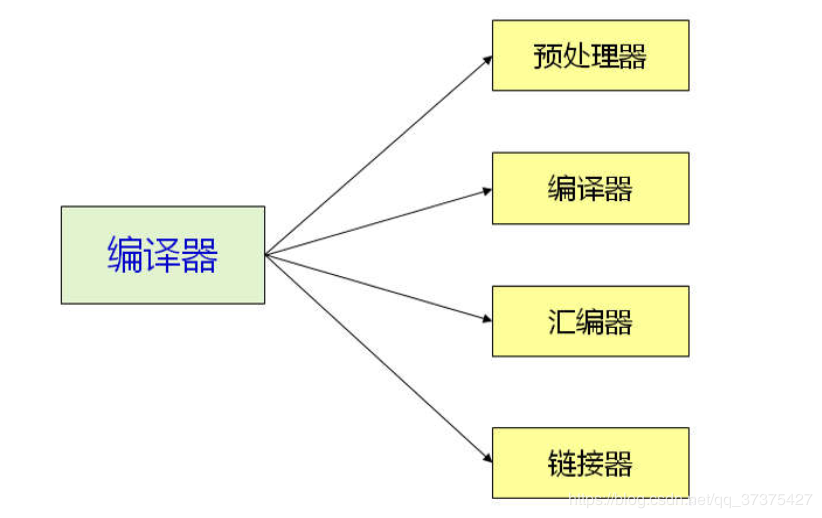
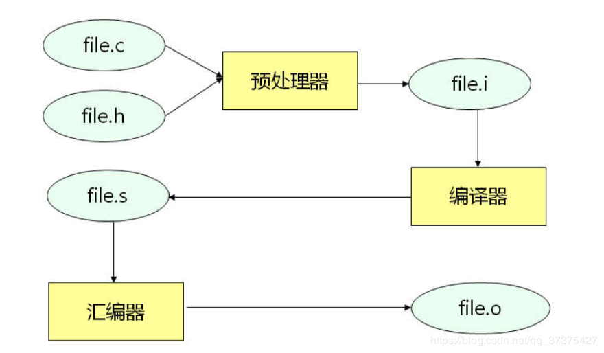
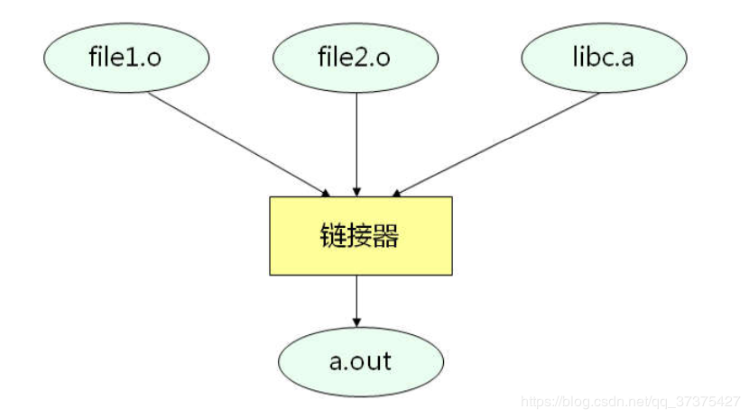
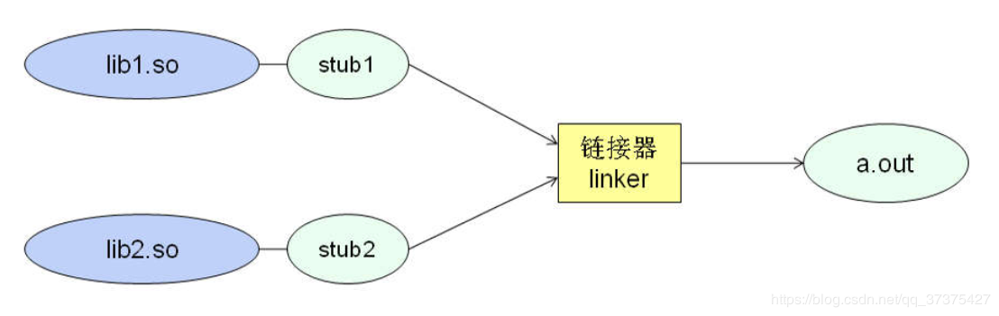
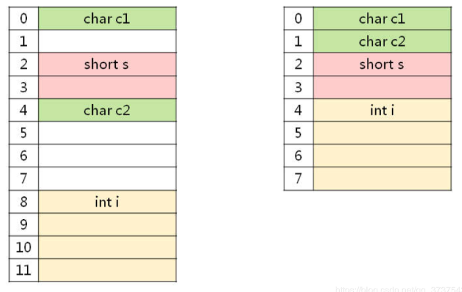

### 编译简介

#### **(广泛的)编译器**



#### **一个C代码的编译过程**



##### 预编译

```shell
gcc -E file.c -o file.i
```

- 处理所有的注释，以空格代替
- 将所有的#define 进行宏展开
- 处理条件编译指令 #if ， #ifdef， #elif ， #else ， #endif
- 处理include，展开被包含的文件
-  保留编译器需要使用的 #pragma 指令 

##### 编译

```shell
gcc -S file.i -o file.s
```

-  对预处理所得到的 .i 文件进行**词法分析，语法分析，语义分析** 
  - 词法分析：分析关键字，标识符，立即数等是否合法
  - 语法分析：分析表达式是否遵循语法规则
  - 语义分析：在语法分析的基础上，进一步分析表达式是否合法
-  **代码优化生成相应的汇编代码文件** 

##### 汇编

```shell
gcc -C file.s -o file.o
```

- 汇编将编译生成的汇编代码转化为机器可以执行的指令

##### 链接



###### 静态链接

```shell
gcc -c lib.c -o lib.o 	# 编译静态库源码
ar -q lib.a lib.o		# 生成静态库文件
gcc main.c lib.a -o main.out	# 使用静态库编译
```

###### 动态链接

​	我们使用的系统函数库都是动态链接的，它是在程序运行的时候才加载库，进行链接



[动态库的使用]( https://blog.csdn.net/qq_37375427/article/details/87868877 )，在使用动态库的时候，在代码中需要使用一些动态库的系统调用 

### 宏

#### *#Define*

​	宏的确是属于编译部分的知识，像是*#define*，在预处理阶段就被替换了。在之前操作系统课中也看到了像是*system_call*这样的宏，不得不说宏的使用是非常灵活的Define

```C
#define _syscall1(type,name,atype,a) \
type name(atype a) \
{ \
long __res; \
__asm__ volatile ("int $0x80" \
	: "=a" (__res) \
	: "0" (__NR_##name),"b" ((long)(a))); \
if (__res >= 0) \
	return (type) __res; \
errno = -__res; \
return -1; \
}
```

另外常见的用法还有**条件编译**，这个在linux库函数中比较常见，C/C++头文件也经常使用条件编译来避免重复导入。 条件编译指令在预编译期就进行了判断，并且将条件为真的代码保留，为假的代码删除 

用GCC编译的时候可以在命令中加入宏定义：

```shell
gcc -Dmacro=val file.c
```

#### *#pragma*

- \#pragma 的实现，在不同的编译器之间是不同的，所以使用它的代码，基本上不能移植代码
- \#pragma 是唯一一个预处理器不处理的指令，它需要保留给编译器处理。
-  \#pragma 用于指示编译器完成一些特殊的动作 
- \#pragma 所定义的很多指示字，是编译器特有的
- \#pragma 在不同的编译器之间是不能移植的

**message**

​	 message参数在**编译时**，输出消息到编译输出窗口中。比如：

```C
#if defined(ANDROID20)
    #pragma message("Compile Android SDK 2.0...")
    #define VERSION "Android 2.0"
#elif defined(ANDROID23)
    #pragma message("Compile Android SDK 2.3...")
    #define VERSION "Android 2.3"
#elif defined(ANDROID40)
    #pragma message("Compile Android SDK 4.0...")
    #define VERSION "Android 4.0"
#else 
    #error Compile Version is not Provided!
#endif
```

**once**

​	在 visual studio中，使用它来替代条件编译，使得头文件只被预处理器导入一次。

**pack**

​	用于指定内存对齐方式

​	先看一个例子：

```C
struct test_11_stru1 {
  char c1;
  short s;
  char c2;
  int i;
};
struct test_11_stru2 {
  char c1;
  char c2;
  short s;
  int i;
};
printf("sizeof(struct test_11_stru1) = %lu\n", 
       sizeof(struct test_11_stru1));
printf("sizeof(struct test_11_stru2) = %lu\n", 
       sizeof(struct test_11_stru2));
/*
sizeof(struct test_11_stru1) = 12
sizeof(struct test_11_stru2) = 8
*/
```

这两个结构体在内存中的布局：



就和之前汇编或者计组中讲到的偶地址访问一样， 实际的计算机系统对基本类型数据在内存中存放的位置有限制，它们会要求这些数据的首地址的值是某个数k（如今通常它为4或8）的倍数，这就是所谓的内存对齐。

```C
struct test_11_stru1 {
  char y;
  short z;
  char k;
  int x;
  char v;	// 增加
};
// sizeof(struct test_11_stru1) = 16 => 默认4字节对齐
#pragma pack(1)
struct test_11_stru1 {
  char y;
  short z;
  char k;
  int x;
  char v;	// 增加
};
#pragma pack()
// sizeof(struct test_11_stru1) = 9
```

在指定了pack后的对齐方式：

-  第一个struct成员永远起始于 0偏移处 
-  每个成员按其**类型大小和pack参数中较小的一个**进行对齐
  - 偏移地址必须能被对齐参数整除
-  结构体总长度，必须为所有对齐参数的整数倍 

#### *#*运算符

​	 在预处理期**将宏参数转换为字符串**

```C
#define STRING(x) #x
void test_12(void) {       
    printf("%s\n", STRING(Hello World));
}
```

#### *##*运算符

​	 在预处理期粘连两个标识符，所以只在宏定义中有效

```C
#define CONNECT(a, b) a##b
int CONNECT(a, 1);	// == int a1

#define NAME(a) name##a

int NAME(1), NAME(2);	// == int name1, name2
```

可以用在，比如为多个需要加上前后缀的类，结构体定义，声明什么的

```C
#define STRUCT(type) struct _tag_##type##__

STRUCT(Student) {
    char* name;
    int id;
};
```

