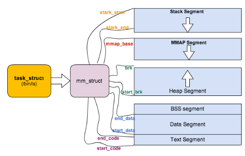
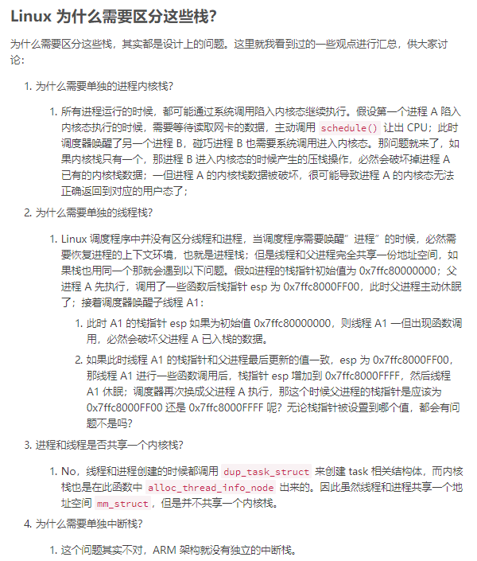

[原文](https://blog.csdn.net/yangkuanqaz85988/article/details/52403726)

### 函数调用

​	在汇编中已经讲过函数调用的过程，OS利用硬件提供的栈实现，Linux下函数调用使用的栈进行参数传递，对于部分可以放到寄存器的参数也会用寄存器传递。8086中用stack传递参数的时候会使用到BP，同样的，在更高级的cpu中，由于架构相同，其实现方式类似，可以看下图，ESP指示栈顶，EBP用于栈内元素的访问。


函数的嵌套调用意味着stack中函数栈帧的堆积，同时也能看到，一个函数(任务)可以表示为{函数代码，stack信息，寄存器信息}，这也是OS能够实现多任务的基础，即只要保存和恢复这些信息，就能够实现任务的切换。

>  任务是一个抽象的概念，即指软件完成的一个活动；而线程则是完成任务所需的动作；进程则指的是完成此动作所需资源的统称 

### 进程栈

​	经常看到进程栈的图示，但是都没有记录下来

- 程序段 (Text Segment)：可执行文件代码的内存映射

- 数据段 (Data Segment)：可执行文件的已初始化全局变量的内存映射
- BSS段 (BSS Segment)：未初始化的全局变量或者静态变量（用零页初始化）
- 堆区 (Heap) : 存储动态内存分配，匿名的内存映射
- 栈区 (Stack) : 进程用户空间栈，由编译器自动分配释放，存放函数的参数值、局部变量的值等
- 映射段(Memory Mapping Segment)：任何内存映射文件


原文在这里利用栈溢出来测试进程栈的大小，约为8M。

```C
void *orig_stack_pointer;

void blow_stack() {
    blow_stack();
}

int main() {
    __asm__("movl %esp, orig_stack_pointer");
    blow_stack();
    return 0;
}
```

Linux内核使用**内存描述符**(mm_struct)表示进程的地址空间

```c
struct mm_struct {
    struct vm_area_struct *mmap;           /* 内存区域链表 */
    struct rb_root mm_rb;                  /* VMA 形成的红黑树 */
    ...
    struct list_head mmlist;               /* 所有 mm_struct 形成的链表 */
    ...
    unsigned long total_vm;                /* 全部页面数目 */
    unsigned long locked_vm;               /* 上锁的页面数据 */
    unsigned long pinned_vm;               /* Refcount permanently increased */
    unsigned long shared_vm;               /* 共享页面数目 Shared pages (files) */
    unsigned long exec_vm;                 /* 可执行页面数目 VM_EXEC & ~VM_WRITE */
    unsigned long stack_vm;                /* 栈区页面数目 VM_GROWSUP/DOWN */
    unsigned long def_flags;
    unsigned long start_code, end_code, start_data, end_data;    
    /* 代码段、数据段 起始地址和结束地址 */
    unsigned long start_brk, brk, start_stack;                   
    /* 栈区 的起始地址，堆区 起始地址和结束地址 */
    unsigned long arg_start, arg_end, env_start, env_end;        
    /* 命令行参数 和 环境变量的 起始地址和结束地址 */
    ...
    /* Architecture-specific MM context */
    mm_context_t context;                  /* 体系结构特殊数据 */

    /* Must use atomic bitops to access the bits */
    unsigned long flags;                   /* 状态标志位 */
    ...
    /* Coredumping and NUMA and HugePage 相关结构体 */
};
```



> 【扩展阅读】：进程栈的动态增长实现
>
> ​	进程在运行的过程中，通过不断向栈区压入数据，当超出栈区容量时，就会耗尽栈所对应的内存区域，这将触发一个 缺页异常 (page fault)。通过异常陷入内核态后，异常会被内核的 expand_stack() 函数处理，进而调用 acct_stack_growth() 来检查是否还有合适的地方用于栈的增长。
>
> ​	如果栈的大小低于 RLIMIT_STACK（通常为8MB），那么一般情况下栈会被加长，程序继续执行，感觉不到发生了什么事情，这是一种将栈扩展到所需大小的常规机制。然而，如果达到了最大栈空间的大小，就会发生 栈溢出（stack overflow），进程将会收到内核发出的 段错误（segmentation fault） 信号。
>
> ​	动态栈增长是唯一一种访问未映射内存区域而被允许的情形，其他任何对未映射内存区域的访问都会触发页错误，从而导致段错误。一些被映射的区域是只读的，因此企图写这些区域也会导致段错误。

### 线程栈

​	Linux的进程和线程都使用task_struct描述，线程可以当成一个和主线程进行资源共享的进程，线程的内存描述符直接指向父进程的内存描述符(CLONE_VM标记)

​	  Linux 进程或者说主线程，其 stack 是在 fork 的时候生成的，实际上就是复制了父亲的 stack 空间地址，然后写时拷贝 (cow) 以及动态增长。然而对于主线程生成的子线程而言，其 stack 将不再是这样的了，而是事先固定下来的，使用 mmap 系统调用 

​	 **线程栈不能动态增长，一旦用尽就没了，这是和生成进程的 fork 不同的地方** 

### 内核栈

​	 在执行系统调用陷入内核之后，这些内核代码所使用的栈并不是原先进程用户空间中的栈，而是一个单独内核空间的栈，这个称作进程内核栈， 进程内核栈在进程创建的时候，通过 slab 分配器从 `thread_info_cache` 缓存池中分配出来，其大小为 `THREAD_SIZE`，一般来说是一个页大小 4K； 

 **current** 宏 

### 中断栈

​	 当系统收到中断事件后，进行中断处理的时候，也需要中断栈来支持函数调用。(汇编)



