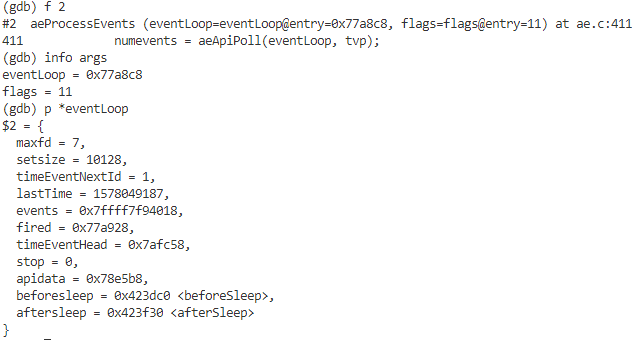

# GDB

## 参考

 范蠡 老师，*gitchat*， [Linux GDB 调试指南](https://gitbook.cn/gitchat/column/5c0e149eedba1b683458fd5f) 。

## 使用GDB的方式

### 直接调试

```shell
gdb filename
```

### 附加进程

```shell
gdb attach <pid>

# 进程id
ps -ef | grep <name>
```

**例子**

```shell
Reading symbols from /usr/lib64/mysql/libmysqlclient.so.18...Reading symbols from /usr/lib64/mysql/libmysqlclient.so.18...(no debugging symbols found)...done.
Reading symbols from /lib64/libpthread.so.0...(no debugging symbols found)...done.
[New LWP 42931]
[New LWP 42930]
[New LWP 42929]
[New LWP 42928]
[New LWP 42927]
[New LWP 42926]
[New LWP 42925]
[New LWP 42924]
[New LWP 42922]
[Thread debugging using libthread_db enabled]
Using host libthread_db library "/lib64/libthread_db.so.1".
Loaded symbols for /lib64/libpthread.so.0
Reading symbols from /lib64/libc.so.6...(no debugging symbols found)...done.
```

​	发行版本的 Linux 系统，有些库是没有调试符号的，因而 GDB 会提示找不到这些库的调试符号。因为目的是调试 chatserver，对系统 API 调用的内部实现并不关注，所以这些提示可以不用关注，只要 chatserver 这个文件有调试信息即可 

​	 当用 gdb attach 上目标进程后，调试器会暂停下来，此时可以使用 continue 命令让程序继续运行，或者加上相应的断点再继续运行程序 

### core文件

```shell
# 先确定系统允许core文件生成
ulimit -a	# 查看
ulimit -c unlimited # 临时设置，可以添加到/etc/profile

gdb <filename> corename
```

#### core文件名的定制

​	*/proc/sys/kernel/core_uses_pid* 可以控制产生的 core 文件的文件名中是否添加 PID 作为扩展，如果添加则文件内容为 1，否则为 0 。*/proc/sys/kernel/core_pattern* 可以设置格式化的 core 文件保存位置或文件名。


​	比如：

```shell
echo "/root/testcore/core-%e-%p-%t" > /proc/sys/kernel/core_pattern
```

## 常用命令

| 命令名称    | 命令缩写 | **命令说明**                                           |
| :---------- | :------- | :----------------------------------------------------- |
| run         | r        | 运行一个程序                                           |
| continue    | c        | 让暂停的程序继续运行                                   |
| next        | n        | 运行到下一行                                           |
| step        | s        | 如果有调用函数，进入调用的函数内部，相当于 step into   |
| until       | u        | 运行到指定行停下来                                     |
| finish      | fi       | 结束当前调用函数，到上一层函数调用处                   |
| return      | return   | 结束当前调用函数并返回指定值，到上一层函数调用处       |
| jump        | j        | 将当前程序执行流跳转到指定行或地址                     |
| print       | p        | 打印变量或寄存器值                                     |
| backtrace   | bt       | 查看当前线程的调用堆栈                                 |
| frame       | f        | 切换到当前调用线程的指定堆栈，具体堆栈通过堆栈序号指定 |
| thread      | thread   | 切换到指定线程                                         |
| break       | b        | 添加断点                                               |
| tbreak      | tb       | 添加临时断点                                           |
| delete      | del      | 删除断点                                               |
| enable      | enable   | 启用某个断点                                           |
| disable     | disable  | 禁用某个断点                                           |
| watch       | watch    | 监视某一个变量或内存地址的值是否发生变化               |
| list        | l        | 显示源码                                               |
| info        | info     | 查看断点 / 线程等信息                                  |
| ptype       | ptype    | 查看变量类型                                           |
| disassemble | dis      | 查看汇编代码                                           |
| set args    |          | 设置程序启动命令行参数                                 |
| show args   |          | 查看设置的命令行参数                                   |

### 基础使用

- *print*不只是打印值，还可以修改值，使用表达式等，使用*ptype*查看类型

  > 如果字符串太长导致无法全部显示，可以使用*set print element 0*设置

- 使用*backtrace*来查看调用堆栈，使用*frame <idx>*转到对应帧

- 断点相关的：*b*， *enable*，*disable*，*info b*，*delete*(所有断点)

- 需要给进程发信号可以使用*signal <signal>*。

#### 控制流

> 常用的函数调用方式有*_cdecl*和*_stdcall*，*C++*非静态成员函数的调用方式是*_thiscall*，在这几种调用方式中，函数的传递都是从右向左入栈，因此如果某个的函数传入参数是别的函数的返回值，通常会从右向左计算，但是*C++ Primer*中提到标准里并没有相关规定，因此如果函数的多个传入参数都是函数，且这些函数的调用顺序会影响结果，不要使用如下形式：
>
> ```C++
> func1(func2(), func3());
> ```
>
> 

- *next*：单步步过
- *step*：单步步入
- *return*：从当前调用函数(不执行完，直接)返回
- *finish*：执行完当前函数并返回
- *until <line>*：执行到某一行后停下
- *jump <line>*：直接跳转到某个位置

**临时断点**

​	*tbreak*：触发一次后就会删除

 **条件断点** 

​	格式：*break [lineNo] if [condition]*，比如：

```shell
break 11 if i==500
```

​	也可以对已经添加的断点设置条件，需要使用*info bread*查看相应的断点编号:

```shell
condition 2 if i==500
```


#### 命令行参数

​	在*run*之前，使用*show(set) args*查看和修改命令行参数，比如

```shell
set args "999 xx" "hu jj"	# 多个参数
```


### 多线程

启动*redis*，直接*run*，挂起程序，查看线程


>  在早期的 Linux 系统的内核里面，其实不存在真正的线程实现，当时所有的线程都是用进程来实现的，这些模拟线程的进程被称为 Light Weight Process（轻量级进程），后来 Linux 系统有了真正的线程实现，这个名字仍然被保留了下来。 

<<<<<<< HEAD
=======
编号为1的线程为主线程，通过*thread <Id>*可以切换线程。

查看线程调用堆栈中函数的输入参数：



#### 线程切换

​	在调试多线程程序的时候，继续之前中断的程序可能会出现线程切换，GDB提供了锁定一个线程的功能，即只有当前线程能运行

```shell
set scheduler-locking on(off)
```

### 多进程

​	指通过*fork*的子进程，可以在子进程*fork*出来后用*gdb attach*，或者使用*follow-fork*选项

```shell
(gdb) show follow-fork mode     
Debugger response to a program call of fork or vfork is "parent".
(gdb) set follow-fork child
(gdb) show follow-fork mode
Debugger response to a program call of fork or vfork is "child".
(gdb) 
```


### 反编译

​	“ 当进行一些高级调试时，我们可能需要查看某段代码的汇编指令去排查问题，或者是在调试一些没有调试信息的发布版程序时，也只能通过反汇编代码去定位问题 ”

​	使用*disassemble*查看反编译代码，使用*show(set) disassembly-flavor* 查看或修改反编译的目标语言

### 监视

​	使用*watch*可以监视变量或者内存，当它发生变化的时候就会中断

>  **watch** 命令是一个强大的命令，它可以用来监视一个变量或者一段内存，当这个变量或者该内存处的值发生变化时，GDB 就会中断下来。被监视的某个变量或者某个内存地址会产生一个 watch point（观察点）

```shell
# 普通变量
int i;
watch i

# 指针
int *p
watch p		# 监视指针本身
watch *p	# 监视指针指向的内存

# 数组
char buf[128]
watch buf	# 监视buf的所有变量
# 此时不是采用硬件断点，而是用软中断实现的。用软中断方式去检查内存变量是比较耗费 CPU 资源的，精确地指明地址是硬件中断
```

>  当设置的观察点是一个局部变量时，局部变量无效后，观察点也会失效。在观察点失效时 GDB 可能会提示如下信息 
>
> ```shell
> Watchpoint 2 deleted because the program has left the block in which its expression is valid
> ```

​	使用*display*设置每次中断都会打印的变量，使用*info display*查看，之后可以用*delete display <idx>*删除。

## TUI窗口

1. 可以使用 gdbtui 命令或者 gdb-tui 命令开启一个调试 

```shell
gdbtui -q # 需要调试的程序名
```

2. 直接使用 GDB 调试代码，在需要的时候使用切换键 **Ctrl + X + A**  

**窗口**

​	可以使用*layout <win>*切换/开启窗口

- （cmd）command 命令窗口，可以输入调试命令
- （src）source 源代码窗口， 显示当前行、断点等信息
- （asm）assembly 汇编代码窗口
- （reg）register 寄存器窗口

## **CGDB**

​	TUI会有“花屏”的问题，CGDB是在GDB上的封装，会更好用一点。但是*print*不能显示中文

##  VisualGDB 

​	
>>>>>>> 98a85147e73c01d6d9e5ec4d872f1de38b3481b6
