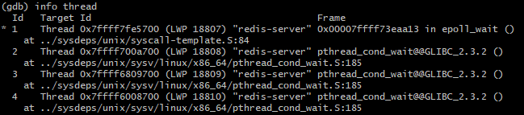

# GDB

## 使用GDB的方式

### 直接调试

```shell
gdb filename
```

### 附加进程

```shell
gdb attach <pid>

# 进程id
ps -ef | grep <name>
```

**例子**

```shell
Reading symbols from /usr/lib64/mysql/libmysqlclient.so.18...Reading symbols from /usr/lib64/mysql/libmysqlclient.so.18...(no debugging symbols found)...done.
Reading symbols from /lib64/libpthread.so.0...(no debugging symbols found)...done.
[New LWP 42931]
[New LWP 42930]
[New LWP 42929]
[New LWP 42928]
[New LWP 42927]
[New LWP 42926]
[New LWP 42925]
[New LWP 42924]
[New LWP 42922]
[Thread debugging using libthread_db enabled]
Using host libthread_db library "/lib64/libthread_db.so.1".
Loaded symbols for /lib64/libpthread.so.0
Reading symbols from /lib64/libc.so.6...(no debugging symbols found)...done.
```

​	发行版本的 Linux 系统，有些库是没有调试符号的，因而 GDB 会提示找不到这些库的调试符号。因为目的是调试 chatserver，对系统 API 调用的内部实现并不关注，所以这些提示可以不用关注，只要 chatserver 这个文件有调试信息即可 

​	 当用 gdb attach 上目标进程后，调试器会暂停下来，此时可以使用 continue 命令让程序继续运行，或者加上相应的断点再继续运行程序 

### core文件

```shell
# 先确定系统允许core文件生成
ulimit -a	# 查看
ulimit -c unlimited # 临时设置，可以添加到/etc/profile

gdb <filename> corename
```

#### core文件名的定制

​	*/proc/sys/kernel/core_uses_pid* 可以控制产生的 core 文件的文件名中是否添加 PID 作为扩展，如果添加则文件内容为 1，否则为 0 。*/proc/sys/kernel/core_pattern* 可以设置格式化的 core 文件保存位置或文件名。


​	比如：

```shell
echo "/root/testcore/core-%e-%p-%t" > /proc/sys/kernel/core_pattern
```

## 常用命令

| 命令名称    | 命令缩写 | **命令说明**                                           |
| :---------- | :------- | :----------------------------------------------------- |
| run         | r        | 运行一个程序                                           |
| continue    | c        | 让暂停的程序继续运行                                   |
| next        | n        | 运行到下一行                                           |
| step        | s        | 如果有调用函数，进入调用的函数内部，相当于 step into   |
| until       | u        | 运行到指定行停下来                                     |
| finish      | fi       | 结束当前调用函数，到上一层函数调用处                   |
| return      | return   | 结束当前调用函数并返回指定值，到上一层函数调用处       |
| jump        | j        | 将当前程序执行流跳转到指定行或地址                     |
| print       | p        | 打印变量或寄存器值                                     |
| backtrace   | bt       | 查看当前线程的调用堆栈                                 |
| frame       | f        | 切换到当前调用线程的指定堆栈，具体堆栈通过堆栈序号指定 |
| thread      | thread   | 切换到指定线程                                         |
| break       | b        | 添加断点                                               |
| tbreak      | tb       | 添加临时断点                                           |
| delete      | del      | 删除断点                                               |
| enable      | enable   | 启用某个断点                                           |
| disable     | disable  | 禁用某个断点                                           |
| watch       | watch    | 监视某一个变量或内存地址的值是否发生变化               |
| list        | l        | 显示源码                                               |
| info        | info     | 查看断点 / 线程等信息                                  |
| ptype       | ptype    | 查看变量类型                                           |
| disassemble | dis      | 查看汇编代码                                           |
| set args    |          | 设置程序启动命令行参数                                 |
| show args   |          | 查看设置的命令行参数                                   |

### 基础使用

- *print*不只是打印值，还可以修改值，使用表达式等，使用*ptype*查看类型
- 使用*backtrace*来查看调用堆栈，使用*frame <idx>*转到对应帧
- 断点相关的*b*， *enable*，*disable*，*info b*，*delete*(所有断点)

### 多线程

启动*redis*，直接*run*，挂起程序，查看线程



>  在早期的 Linux 系统的内核里面，其实不存在真正的线程实现，当时所有的线程都是用进程来实现的，这些模拟线程的进程被称为 Light Weight Process（轻量级进程），后来 Linux 系统有了真正的线程实现，这个名字仍然被保留了下来。 

